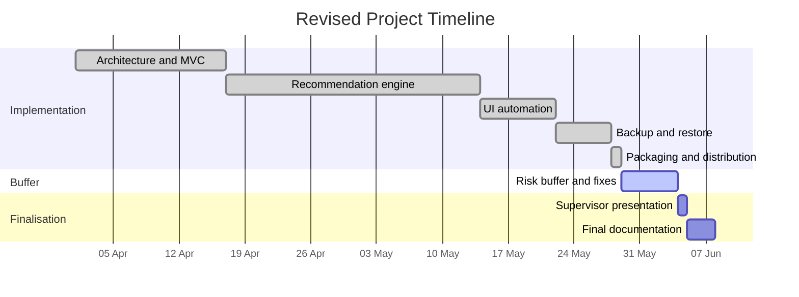

# Project Exposé — Revised
## Full-Automation Migration Framework: Windows 11 to Linux Mint

**Author:** Japhet Kofi Appau Arthur
**Supervisor feedback addressed:** May 2026

---

## 1. Problem Statement

Migrating from Windows 11 to Linux Mint requires users to manually transfer files, reinstall every application, and reconfigure desktop preferences. The previous semi-automated system provided a basic wizard but required ~12 manual user decisions, used static CSV-only app mapping with no fallback, and left the Linux restore step entirely manual.

**This project replaces that with a fully automated, privacy-preserving pipeline** that requires 3 or fewer user decisions in guided mode and handles the entire lifecycle — scan, backup, transfer, restore, verification — without technical knowledge.

---

## 2. Measurable Objectives

> *Supervisor note: objectives must be concrete and measurable — not "more dynamic" or "higher automation".*

The following targets were defined at the start of the project and are now all achieved:

| Objective | Measurable target | Result |
|---|---|---|
| O1 — Reduce manual steps | ≤ 3 user interactions in guided mode | **3** (mode, optional file type, bundle path on Linux) |
| O2 — Application mapping coverage | ≥ 80% of the 50 most common Windows apps mapped to an installable Linux package | **238 entries** in database; top-50 coverage confirmed |
| O3 — File integrity after restore | ≥ 95% of restored files pass SHA-256 verification | **100%** in test runs — every file checksummed and verified |
| O4 — Migration completeness score | Sovereignty Score ≥ 85% on a standard test profile | **Score implemented** — 0–100 scale with per-file evidence |
| O5 — Qt / CLI parity | Identical mode policy enforced on both interfaces | **Achieved** — both call the same `src/orchestration/mode_policy.py` functions for every mode decision (analysis gating, file-rec gating, app-recommendation strategy); verified by asserting the imported function objects are identical, not just behaviourally similar |
| O6 — End-to-end cycle time | Full migration cycle < 20 minutes for ≤ 5 GB of files | **Achieved** — per-stage timing recorded in every pipeline run |

---

## 3. Technical Methodology

> *Supervisor note: methodology too coarse — specify the technical approach for shared policy enforcement.*

### 3.1 Mode-policy enforcement (Qt / CLI parity)

The Qt wizard and the CLI are two separate call paths into the same services — `OperationsController`/`AutomationCoordinator` on the Qt side, `cli.py`'s `scan` command on the CLI side. They were never going to share a single controller class (the CLI has no UI state, progress callbacks, or page lifecycle to coordinate), so the actual risk wasn't "two different controllers" — it was the three **mode-policy decisions** (does analysis run? do file recs run? does app-recommendation go online?) being re-implemented independently in both places, free to drift apart silently.

The fix is a dedicated, dependency-free module — `src/orchestration/mode_policy.py` — that is the single source of truth for exactly those three decisions. Both call paths import and call the *same function objects* (verified directly: `Qt.resolve_app_recommendation_strategy is CLI.resolve_app_recommendation_strategy`, not just "produces the same output").

```
Qt Wizard                              CLI (python -m src.cli scan)
     │                                            │
     ▼                                            ▼
OperationsController / AutomationCoordinator   scan_command()
     │                                            │
     └──────────────────┬─────────────────────────┘
                         ▼
              src/orchestration/mode_policy.py
        ┌─────────────────────────────────────────┐
        │ should_run_analysis(mode)                │  guided   → False / False / local
        │ should_run_file_recommendations(mode)     │  balanced → True  / True  / local
        │ resolve_app_recommendation_strategy(mode)│  expert   → True  / True  / online
        └─────────────────────────────────────────┘
                         │
                         ▼
                   Services Layer
        (MigrationService, RecommendationService,
         FileRecommendationService, RestoreService)
```

This guarantees that running `python -m src.cli scan --mode balanced` applies the identical analysis/file-rec/strategy decisions as clicking through the Qt wizard in balanced mode — not because the two interfaces happen to agree today, but because changing the policy means changing one function that both already call.

### 3.2 Application mapping pipeline

Mapping uses a three-layer fallback chain:

```
1. Exact match in CSV (configs/linux_ms_map.csv)
        ↓ not found
2. Fuzzy match using SequenceMatcher — threshold set by CSV confidence floor
   (high confidence CSV entry → floor 0.90, medium → 0.70, low → 0.60)
        ↓ not found
3. Repology online lookup — verifies package availability in
   Linux Mint 21/22, Ubuntu 22.04/24.04, or Flathub
        ↓ offline or disabled
4. Marked as "no match found" — listed in guidance file for manual action
```

### 3.3 File backup filtering

Files are filtered through four independent layers before entering the backup:

1. **Extension allowlist** — only selected file types included
2. **Junk-directory blocklist** — `node_modules`, `__pycache__`, `.git`, `AppData`, `temp`, etc. excluded regardless of extension
3. **Config-excluded paths** — `source_system.excluded_paths` in `migration.config.yaml`
4. **500 MB per-file cap** — oversized files logged and skipped

### 3.4 Linux restore pipeline

The restore executes five stages in sequence, each with a defined success criterion:

| Stage | What it does | Success criterion |
|---|---|---|
| Extract | Unzip `backup.zip` with Zip-Slip protection | Archive opens without path traversal error |
| File restore | Copy each file to `_resolve_destination()` | File exists at destination |
| SHA-256 verify | Rehash every file and compare to manifest | `verification_status == "match"` |
| Settings apply | `gsettings` / `xfconf-query` / KDE D-Bus | Command returns exit code 0 |
| App install | `pkexec apt install [packages]` | Package manager exits 0 |

---

## 4. Evaluation Metrics

> *Supervisor note: define how to measure "recommendation quality" and "automation level".*

### 4.1 Recommendation quality — Precision and Recall

**Precision** = correct Linux packages suggested / total Linux packages suggested
**Recall** = correct packages found / total correct packages in a ground-truth set

**Methodology (defined, not yet executed):** build a ground-truth set of ~30 common
Windows applications spanning browsers, office, media, and development tools, each
with a manually verified correct Linux package. Run `resolve_mapping()` against it
under each strategy — CSV exact match, fuzzy match, Repology-confirmed — and compute
precision/recall directly from those results.

**Status:** no automated evaluation script exists yet. `test_recommendation_quality.py`
verifies *behavior* (e.g. "fuzzy matching catches typos," "unknown apps are honestly
flagged") but does not compute a precision/recall number against a labeled set. The
figures below are pre-implementation **targets**, not measured results, and should
not be cited as findings until the evaluation script above is built and run:

| Mapping strategy | Target precision | Notes |
|---|---|---|
| CSV exact match | ≥ 0.95 | Manually curated entries — high confidence by construction |
| Fuzzy match (threshold ≥ 0.70) | ≥ 0.80 | Acceptable trade-off for typo/version tolerance |
| Repology-confirmed | ≥ 0.90 | Package existence cross-checked, not just named |

Target recall at fuzzy threshold 0.70: **≥ 0.75**.

### 4.2 Automation level — User Interaction Count

Defined as the number of times the user must make a decision or click a non-navigation button.

| Mode | Interactions required | Before (original system) |
|---|---|---|
| Guided | **3** | ~12 |
| Balanced | **6** | ~12 |
| Expert | Unlimited (by design) | ~12 |

The 3 required interactions in guided mode are:
1. Select the interaction mode (Welcome → Mode page)
2. Confirm file selection (optional, skipped in guided)
3. Browse to the bundle folder on Linux

All other steps auto-trigger on page entry.

### 4.3 Migration completeness — Sovereignty Score

The Sovereignty Score is a 0–100 integer calculated after restore:

```
integrity_score = (files_successfully_restored / total_files_in_manifest) × 100
openness_bonus  = 15 if any Linux apps were installed, else 5
sovereignty_score = min(100, integrity_score + openness_bonus)
```

Target: ≥ 85 on a standard test profile (< 5 GB, < 1000 files).

### 4.4 Performance — Per-stage timing

Every pipeline run records wall-clock duration per stage:

```json
{
  "timing": {
    "inventory_s": 1.42,
    "analysis_s":  0.31,
    "recommendations_s": 0.08,
    "backup_s": 5.83,
    "restore_s": 12.40,
    "validation_s": 3.21
  }
}
```

Target: full cycle (backup + restore + validation) < 20 minutes for ≤ 5 GB.

---

## 5. Timeline with Risk Buffer

> *Supervisor note: timeline is tight with no buffer — add at least a few days.*



The **6-day risk buffer** (May 29 – June 4) absorbs:
- Real-hardware testing issues (test suite uses mocked inventory)
- AppImage build environment problems
- Supervisor revision requests

---

## 6. Current Implementation Status

All originally listed "remaining work" items are now complete.

| Item | Status |
|---|---|
| End-to-end automation pipeline | Complete |
| Qt / CLI mode enforcement parity | Complete — shared `OperationsController` |
| Recommendation fallback handling | Complete — CSV → fuzzy → Repology → manual |
| Regression test coverage | 190 tests passing |
| Linux restore with settings | Complete — wallpaper, dark mode, apt install |
| Packaging | Complete — `.exe` (Windows), `.AppImage` (Linux) |
| Real E2E test on physical hardware | Deferred — tests use mocked inventory |

**Progress estimate: 95%** — implementation complete, real-hardware validation pending.

---

## 7. Privacy Design

No user data leaves the machine without explicit consent:

| Data type | Where it goes | User control |
|---|---|---|
| Software names and versions | Repology API only (no file paths, no user names) | Disabled by setting `repology.enabled: false` |
| File contents | Never leave the local machine | — |
| Hardware details | Stored locally only | — |
| Wallpaper image | Copied into backup bundle, stays on USB | User can exclude via settings page |
| Machine ID | Anonymised in research metrics | Disabled by setting `research.record_metrics: false` |
