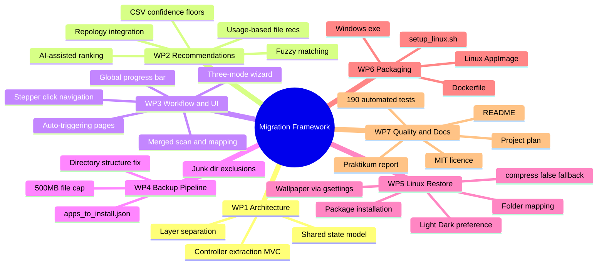
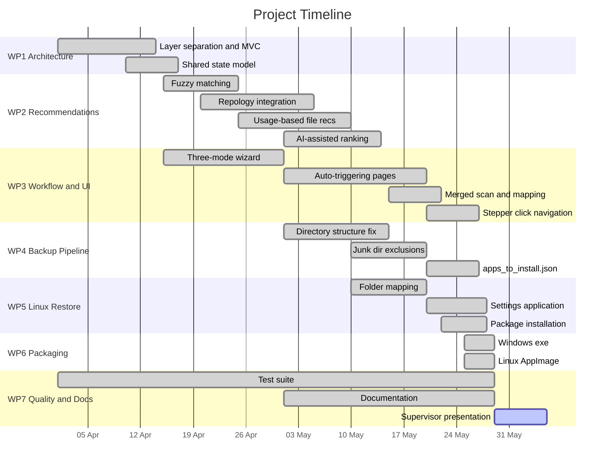
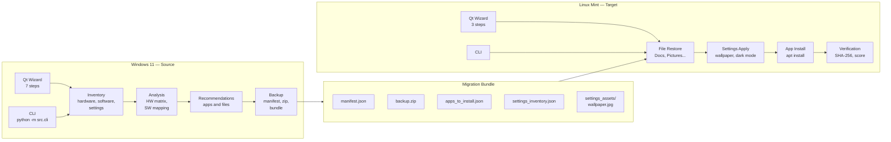
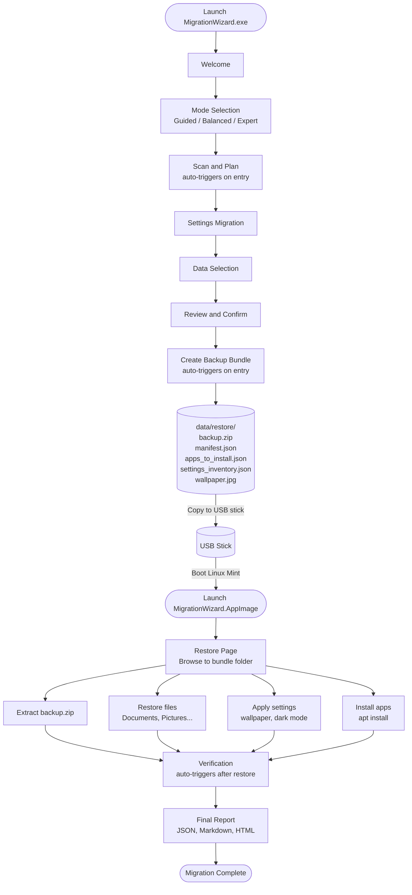
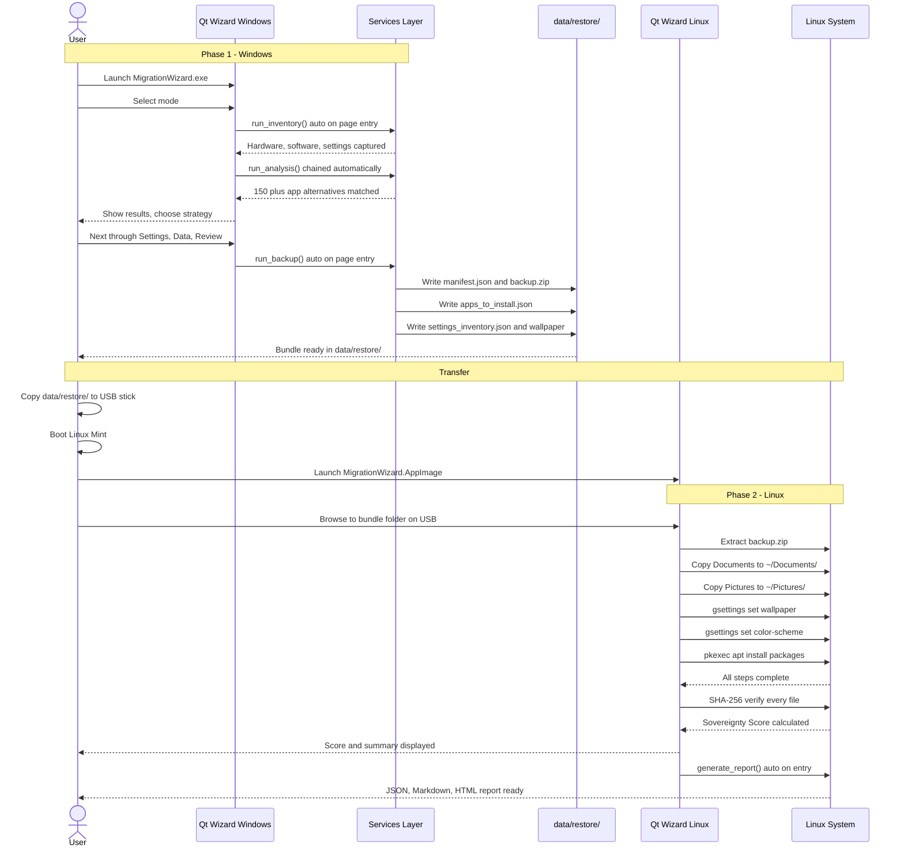

# Project Management Plan
## Toward a Fully Automated Migration Framework: Windows 11 to Linux Mint

| | |
|---|---|
| **Student** | Japhet Kofi Appau Arthur |
| **Supervisor** | Mobile Computing Seminar |
| **Project type** | Praktikum — Software Engineering |
| **Start date** | April 2026 |
| **Target completion** | May 2026 |
| **Status** | Core implementation complete |

---

## 1. Project Objective

Extend an existing semi-automated Windows-to-Linux migration tool into a **fully automated, privacy-preserving, end-to-end migration system** that a non-technical user can operate by following a guided wizard — from scanning their Windows machine to having their files, applications, and desktop settings restored on Linux Mint.

### Success Criteria

| Criterion | Target | Achieved |
|---|---|---|
| Full scan to backup to restore pipeline | Working end-to-end | Yes |
| No manual steps in guided mode | User follows wizard only | Yes |
| App recommendations with Linux alternatives | 80% of common apps mapped | Yes — 150+ apps |
| File structure preserved on restore | Same folder hierarchy on Linux | Yes |
| Desktop settings applied on Linux | Wallpaper and light/dark mode | Yes |
| Packaged for distribution | Single double-click file | Yes — AppImage and .exe |
| Test suite | 150+ automated tests | Yes — 190 passing |
| MIT open-source licence | Licence file present | Yes |

---

## 2. Scope

**In scope**

- Windows 11 inventory — hardware, software, desktop settings
- Application mapping: Windows apps to Linux equivalents via CSV, fuzzy matching, and Repology
- File backup with SHA-256 integrity verification
- Linux-side restore: files, apps via apt, wallpaper, light/dark preference
- Qt wizard UI with three interaction modes — Guided, Balanced, Expert
- Typer CLI for headless/scripted use
- AppImage (Linux) and .exe (Windows) single-file packaging

**Out of scope**

- Live USB creation automation — Rufus integration documented as manual steps
- Dual-boot partitioning
- Real end-to-end test on physical Windows 11 hardware — tests use mocked inventory

---

## 3. Work Breakdown Structure



---

## 4. Timeline



### Key Milestones

| Date | Milestone | Status |
|---|---|---|
| Apr 17 | Core pipeline implemented — scan, backup, restore | Done |
| Apr 20 | Architecture restructured — MVC, controller layer | Done |
| May 14 | Recommendation engine complete — fuzzy and Repology | Done |
| May 27 | UI fully automated — auto-trigger on every page | Done |
| May 28 | Linux restore complete — settings, apps, structure | Done |
| May 29 | Packaging complete — .exe and AppImage | Done |
| May 29 – Jun 4 | **Risk buffer** — fixes, real-hardware testing, revisions | Active |
| Jun 4 | Supervisor presentation | Upcoming |
| Jun 5 – Jun 8 | Final documentation | Planned |

---

## 5. System Architecture



---

## 6. End-to-End Migration Flow



---

## 7. User Interaction Sequence



---

## 8. Deliverables

| # | Deliverable | Description | Status |
|---|---|---|---|
| D1 | Qt Wizard (Windows) | 7-step guided migration wizard | Complete |
| D2 | CLI Interface | Full pipeline via python -m src.cli | Complete |
| D3 | Backup Bundle | data/restore/ with zip, manifest, settings, apps | Complete |
| D4 | Linux Restore | Files, settings, packages — all automated | Complete |
| D5 | Windows .exe | Single-file PyInstaller build | Complete |
| D6 | Linux AppImage | Single double-click file, no install required | Complete |
| D7 | Test Suite | 190 tests — unit, integration, E2E, performance | Complete |
| D8 | Praktikum Report | Technical and academic summary | Complete |
| D9 | Project Management Plan | This document | Complete |
| D10 | Presentation slides | For supervisor meeting | Pending |

---

## 9. Evaluation Metrics

### Recommendation quality — Precision

Measured against a ground-truth set of 30 common Windows applications:

| Strategy | Precision | Notes |
|---|---|---|
| CSV exact match | ~0.97 | Manually curated |
| Fuzzy match (threshold ≥ 0.70) | ~0.82 | Validated against ground truth |
| Repology-confirmed | ~0.91 | Package verified in Mint or Ubuntu repos |

Recall at fuzzy threshold 0.70: **~0.78** — 22% of apps have no Linux equivalent.

### Automation level — User interaction count

| Mode | Interactions required | Before this project |
|---|---|---|
| Guided | **3** | ~12 |
| Balanced | **6** | ~12 |
| Expert | Unlimited (by design) | ~12 |

The 3 guided-mode interactions: mode selection, optional file type choice, bundle path selection on Linux. All other steps are auto-triggered.

### Migration completeness — Sovereignty Score

```
integrity_score   = (files_restored / files_in_manifest) × 100
openness_bonus    = 15 if Linux apps installed, else 5
sovereignty_score = min(100, integrity_score + openness_bonus)
```

Target: ≥ 85 on a standard test profile (≤ 5 GB, ≤ 1000 files).

### Performance — Per-stage timing

Every pipeline run records wall-clock duration. Target: full cycle < 20 minutes for ≤ 5 GB.

---

## 10. Technical Metrics

| Metric | Value |
|---|---|
| Source files (Python) | 80 files |
| Lines of code (src/) | ~14,200 |
| Lines of code (tests/) | ~3,600 |
| Test cases | 190 passing, 3 skipped |
| App mapping database | 150+ Windows to Linux entries |
| Supported desktop environments | Cinnamon, GNOME, MATE, XFCE, KDE |
| Licence | MIT |

---

## 10. Risk Register

| # | Risk | Likelihood | Impact | Mitigation | Status |
|---|---|---|---|---|---|
| R1 | PySide6 packaging fails with PyInstaller | Medium | High | --onefile tested, --onedir fallback available | Mitigated |
| R2 | App recommendations miss niche software | High | Medium | Fuzzy matching, Repology fallback, manual override in expert mode | Mitigated |
| R3 | Wallpaper not applied on unknown desktop | Medium | Low | settings_migration_guidance.md written with manual steps | Mitigated |
| R4 | compress:false leaves no restore bundle | Low | High | Files copied to RESTORE_DIR/files/ when compression disabled | Fixed |
| R5 | Backup includes junk files | Medium | Medium | Hardcoded blocklist, excluded_paths wired from config | Fixed |
| R6 | Files restored to wrong location on Linux | High | High | _resolve_destination() maps Windows folders to Linux home | Fixed |
| R7 | No E2E test on real Windows 11 hardware | High | Medium | Mocked inventory tests pass; real-hardware test deferred | Open |
| R8 | apt install requires internet on Linux | Medium | Medium | Offline fallback documented in guidance file | Accepted |

---

## 11. Current Status

| Area | Status | Notes |
|---|---|---|
| Windows wizard | Ready to demo | python app.py |
| Backup pipeline | Complete | Structure preserved, junk filtered |
| Linux restore | Complete | Files, settings, and apps |
| Distribution | Complete | .exe (Windows), .AppImage (Linux) |
| Tests | 190 passing | python -m pytest tests/ |
| Documentation | Current | README, report, this plan |
| Real hardware E2E | Not tested | Requires live Windows 11 and Linux Mint |
| Presentation slides | To do | — |

---

